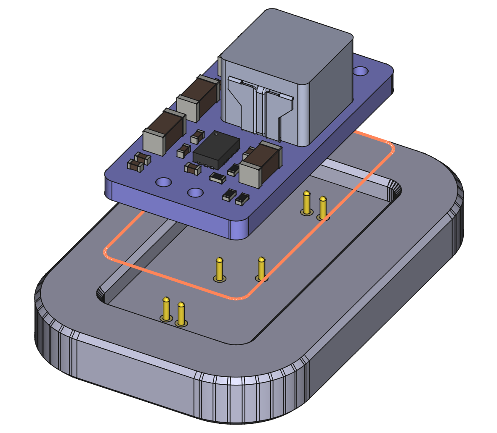

# PCB Jigify!



Generate holding and testing jigs for your PCBs directly from your PCB files!

Additional features:
* embed magnets in the jigs
* include registration features
* tight KiCad integration

## Installation

Using [pipx](https://pipx.pypa.io/stable/) ([installation instructions](https://pipx.pypa.io/stable/installation/)) is
recommended:

```sh
pipx install pcb-jigify
```

Alternatively, if the above doesn't work for you (PyPi doesn't allow GitHub dependencies,
so our CadQuery version is quite outdated), you can try installing directly from GitHub:

```sh
pipx install git+https://github.com/mmalecki/pcb-jigify.git
```

## Usage

### Holding jigs
This type of jig holds the PCB in place, for example for solder paste application.

#### KiCad
PCB Jigify integrates tightly with KiCad, but [can also be used with other ECADs](#dxf) that
are able to export DXF files.

##### Generate the jig
You can generate the most basic of jigs by passing in an input board, and output model file:

```sh
pcb-jigify holding --output holder.step pcb.kicad_pcb
```

##### Optional: place registration features
If you have any registration features (for example, pins, such as used in the [eC-Registration system](https://www.eurocircuits.com/ec-registration-system/)), you can generate a jig with them included.

For example, to use a mounting hole as a registration feature, edit the mounting hole footprint to include the paste and one of the user layers. We'll be using the `User.Eco1` layer:


In manufacturing, this will cause the stencil to have the mounting hole etched through (because the paste layer indicates a stencil opening), the PCB drilled (as indicated by the drill point), and the holder to have a hole for press-fitting it (due to our very own `User.Eco1` indicator).

Then, when generating the jig, pass the same registration layer, and how
deep the registration features should be cut into the jig, for example"

```sh
pcb-jigify holding \
    --registration-layer User.Eco1 --registration-depth 2 \
    --output holder.step \
    pcb.kicad_pcb
```

to make a 2 mm cut into the jig using contents of `User.Eco1` layer.

Note: the stencil, drilling and copper etching processes are separate parts of the manufacturing process. The quality of alignment of drilled holes in the PCB, etches in the stencil and the copper layer depends sorely on your manufacturer. In other words, know your limitations using this method.

#### DXF
DXF is a CAD file format many ECAD applications are able to output to.

##### Generate the jig

To generate a jig from DXF files, pass in the edge cuts file, and optionally the registration layer, for example:

```sh
pcb-jigify holding \
    [--registration-layer pcb-User_Eco1.dxf --registration-depth 2] \
    --output holder.step \
    pcb-Edge_Cuts.dxf
```

### Testing jigs

Testing jigs utilizing pogo pins can be generated in a similar fashion.

In order to place testing features, pick a testing layer. We'll be using `User.Eco2` in our examples.

Add a "copper" layer `User.Eco2` to pads you want to target with test probes. They don't need to be test pads - you can add this layer to any pad, test probe will be placed at its center.

You will also need to pass in the test probe diameter and the holding length.  
As an example, for a [Mill-Max spring-loaded pin with solder cup termination (0955-0-15-20-71-14-11-0)](https://www.mill-max.com/products/discrete-spring-loaded-pins/spring-loaded-pin-with-solder-cup-termination/0955/0955-0-15-20-71-14-11-0), the diameter would be 0.889 mm (0.035" in the datasheet), and the length 4.0894 mm (0.301" - 0.140" = 0.161" in the datasheet).

```sh
pcb-jigify testing \
    --testing-layer User.Eco2 --test-probe-diameter 0.889 --test-probe-length 4.0894 \
    --output tester.step \
    pcb.kicad_pcb
```

Registration layer is also supported here, if desired.

Note: due to small dimensions of most test probes, you may have to print the testing jigs on a resin printer.

### Jig configuration

PCB Jigify allows for in-depth configuration of some of the features of the jigs.

#### Common

* PCB fit - `--pcb-fit` - how much clearance should there be between the PCB
  and the holder (default: 0.1 mm)

## Tips, tricks, notes

* Registration pins can be made from anything, including gold header pins stripped of their plastic part or bolts with their heads cut off
* Slicers may complain about open edges or other faults in generated files. As long as the file looks printable, this shouldn't cause any issues.
* If the generation of the jig fails for any reason, don't hesitate to [open an issue](https://github.com/mmalecki/pcb-jigify/issues/new), preferably with a DXF export of the board outline layer included.
